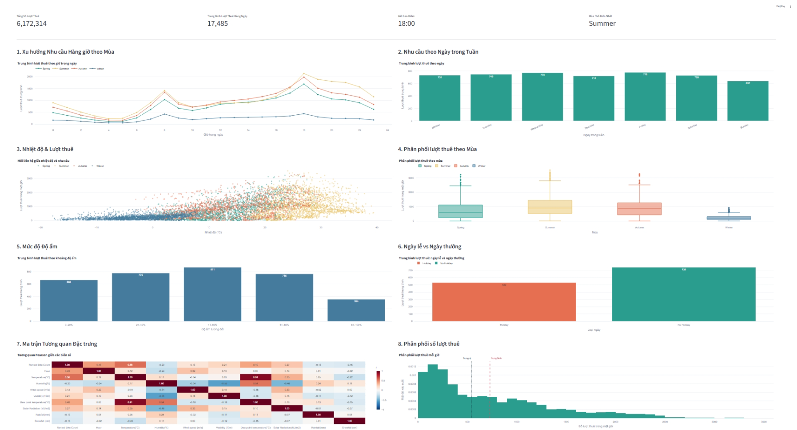

# Đồ án: Phân tích và dự báo nhu cầu sử dụng dịch vụ chia sẻ xe đạp tại Seoul.

## Overview

Đây là đề tài phân tích dữ liệu về việc chia sẻ xe đạp của nhóm 26 - Khoa CNTT - Trường Đại học Công Nghệ Thông Tin TPHCM, bao gồm việc khám phá dữ liệu, trực quan hóa và mô hình hóa để hiểu rõ hơn về xu hướng sử dụng xe đạp trong thành phố Seoul.

Nhóm 26 gồm các thành viên: 

| Họ và tên       | Mã số sinh viên | Email Trường           | Email cá nhân             |
| --------------- | --------------- | ---------------------- | ------------------------- |
| Nguyễn Thái Hòa | 25410216        | 25410216@ms.uit.edu.vn | thaihoa311@gmail.com      |
| Đặng Quang Lợi  | 25410245        | 25410245@ms.uit.edu.vn | loidq09@gmail.com         |
| Bạch Thế Hiển   | 25410205        | 25410205@ms.uit.edu.vn | bachthehienpp18@gmail.com |

## Mốc thời gian dự kiến

- 26/09/2026: Bắt đầu làm việc (bắt đàu viết Jupiter notebooks và các chương báo cáo (1,2: Hiển; 3,4: Hòa; 5,6: Lợi))
- 01/10/2026: Hoàn thành các chương báo cáo và jupiter notebooks.
- 4/10/2026: Hoàn thiện báo cáo, slide thuyết trình và video demo
- 5/10/2026: Quay thuyết trình
- **8/10/2026: Nộp báo cáo, slide, video demo và source code**

## Dataset

Dữ liệu được sử dụng trong phân tích này bao gồm thông tin về các chuyến đi xe đạp, thời gian, địa điểm, và các thông tin liên quan khác như nhiệt độ, độ ẩm, và điều kiện thời tiết. Dữ liệu giúp chúng ta phân tích hành vi người dùng và các yếu tố ảnh hưởng đến việc sử dụng dịch vụ chia sẻ xe đạp.

## Mục tiêu

Mục tiêu của phân tích này là:
- Khám phá dữ liệu để hiểu rõ hơn về các mẫu sử dụng xe đạp.
- Trực quan hóa dữ liệu để nhận diện các xu hướng và mối quan hệ.
- Xây dựng các mô hình dự đoán để dự đoán nhu cầu sử dụng xe đạp trong tương lai.
- Đưa ra các khuyến nghị dựa trên kết quả phân tích để cải thiện dịch vụ chia sẻ xe đạp.

## Chuẩn bị cho báo cáo và thuyết trình

- Báo cáo chính thức: [Link tới báo cáo](noi-dung-bao-cao/bao-cao/README.md)
- Yêu cầu báo cáo: [Link tới yêu cầu báo cáo](noi-dung-bao-cao/bao-cao/yeu-cau-bao-cao.md)
- Nội dung thuyết trình: [Link tới thuyết trình](noi-dung-bao-cao/thuyet-trinh/README.md)
- Biên bản họp: [meeting-notes/](meeting-notes/)

### File cần nộp

https://1drv.ms/f/c/f583dd69288db217/IgAmhO6m-X-GTrk4cqEK8TcFAfKDtrBz6iJ-kM1rV_6v_K4?e=IZt7Qj

- [-] Báo cáo chính thức: word, pdf 
- [-] Slide thuyết trình: ppt (10p)
- [-] Video thuyết trình: mp4 (10 phút + Demo 5 phút)
- [-] Source code: notebooks, dashboard, src
