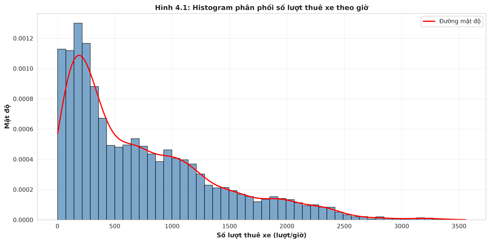
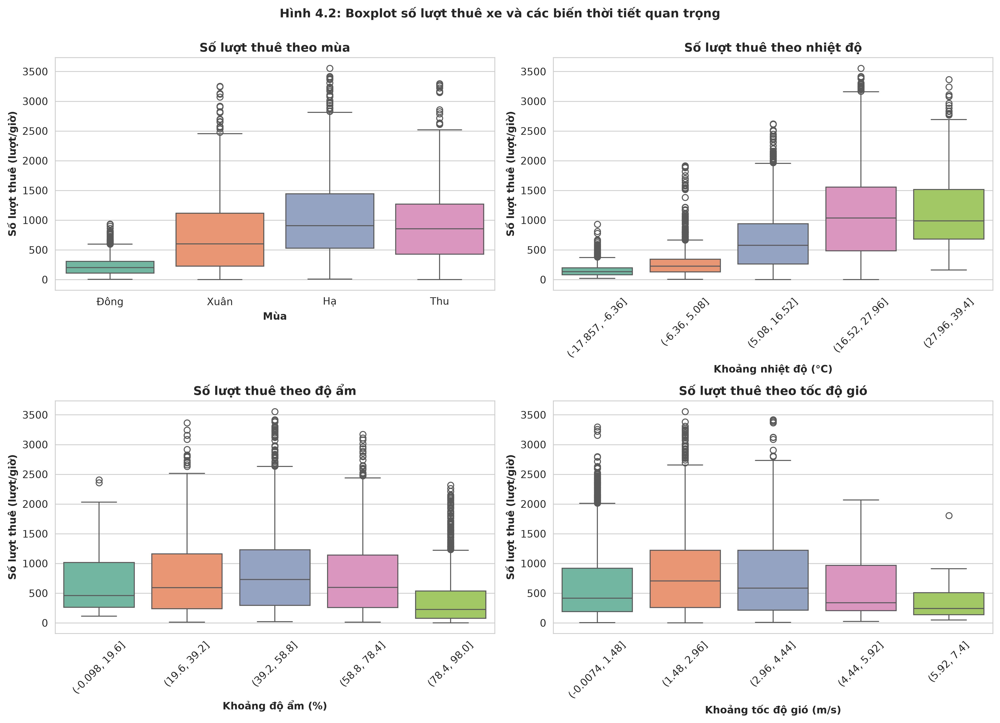
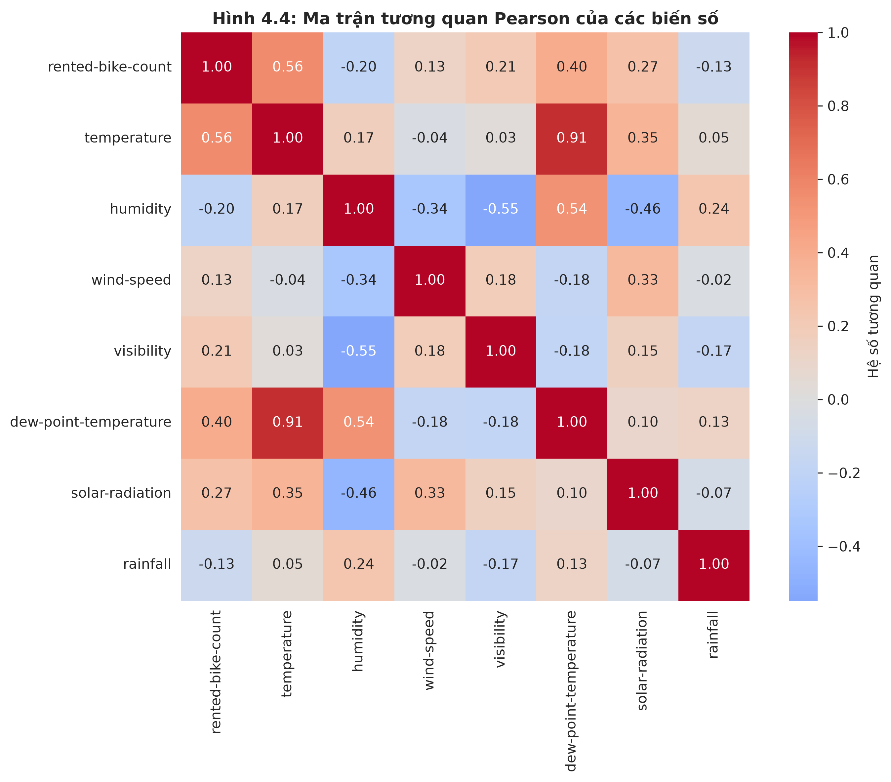
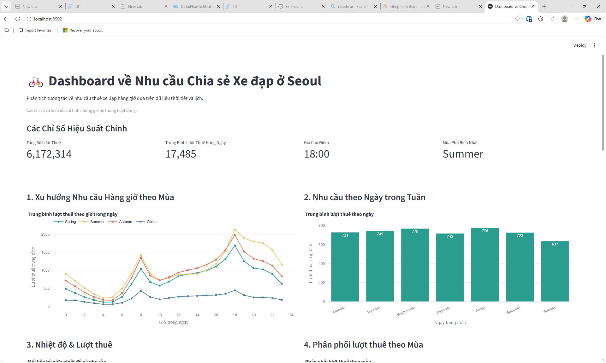

## CHƯƠNG 4. PHÂN TÍCH THĂM DÒ VÀ TƯƠNG QUAN

### 4.1. Mục tiêu và phương pháp

Phân tích thăm dò được thực hiện để nhận diện xu hướng nhu cầu thuê xe theo thời gian, mùa và một số điều kiện thời tiết; đồng thời khảo sát các mối liên hệ tuyến tính giữa biến mục tiêu và các biến số. Các công cụ được sử dụng gồm histogram, boxplot, violin plot, biểu đồ phân tán kèm đường hồi quy, ma trận tương quan Pearson và bảng tổng hợp theo nhóm. Phân tích này nhằm mô tả và phát hiện mẫu hình trong dữ liệu, không dùng tương quan hoặc khác biệt nhóm để khẳng định quan hệ nhân quả.

Phạm vi phân tích vẫn là 8.465 quan sát có `Functioning Day = Yes`. Vì các quan sát được ghi nhận liên tiếp theo giờ, chúng có thể không độc lập hoàn toàn. Do đó, kết quả kiểm định nhóm được trình bày như bằng chứng thăm dò và cần được diễn giải thận trọng.

### 4.2. Phân phối nhu cầu theo thời gian và mùa

Theo giờ trong ngày, nhu cầu trung bình thấp nhất vào 04:00, đạt 137,49 lượt/giờ, sau đó tăng vào buổi sáng và buổi chiều. Mức trung bình cao nhất xuất hiện lúc 18:00 với 1.554,02 lượt/giờ; các giờ 17:00, 19:00 và 20:00 lần lượt đạt 1.177,21, 1.235,78 và 1.105,30 lượt/giờ. Mẫu hình này cho thấy nhu cầu tập trung rõ hơn vào các khung giờ đi lại, đặc biệt vào cuối ngày. Đây là mô tả theo thời điểm, chưa đủ cơ sở kết luận rằng giờ trong ngày là nguyên nhân của nhu cầu.

Histogram và boxplot hỗ trợ quan sát hình dạng phân phối, trung vị, khoảng tứ phân vị (IQR) và các giá trị nằm xa phần trung tâm; các biểu đồ được diễn giải cùng thống kê mô tả ở Chương 3.

*Hình 4.1: Histogram phân phối số lượt thuê xe theo giờ, kèm đường mật độ*

*Hình 4.2: Boxplot số lượt thuê xe và các biến thời tiết quan trọng*

**Bảng 4.1. Số lượt thuê theo mùa**

| Mùa  | Số quan sát | Trung bình | Trung vị | Độ lệch chuẩn |
| ---- | ----------: | ---------: | -------: | ------------: |
| Xuân |       2.160 |     746,25 |   599,00 |        618,67 |
| Hạ   |       2.208 |   1.034,07 |   905,50 |        690,24 |
| Thu  |       1.937 |     924,11 |   856,00 |        617,55 |
| Đông |       2.160 |     225,54 |   203,00 |        150,37 |

Mùa Hạ có nhu cầu trung bình cao nhất, đạt 1.034,07 lượt/giờ, tiếp theo là mùa Thu và mùa Xuân. Mùa Đông thấp hơn rõ rệt, chỉ đạt 225,54 lượt/giờ. Chênh lệch này được quan sát đồng thời với sự thay đổi của điều kiện thời tiết và thời gian trong năm, vì vậy không nên quy toàn bộ khác biệt cho riêng một yếu tố thời tiết.

### 4.3. Tương quan giữa nhu cầu và các biến số

Hệ số tương quan Pearson giữa số lượt thuê và nhiệt độ là `r = 0,563`, thể hiện mối liên hệ tuyến tính dương ở mức vừa. Hệ số giữa số lượt thuê và độ ẩm là `r = -0,202`, thể hiện mối liên hệ âm yếu. Các biến thời tiết khác có tương quan dương yếu: bức xạ mặt trời `r = 0,274`, tầm nhìn `r = 0,212` và tốc độ gió `r = 0,125`. Nhiệt độ điểm sương (`r = 0,400`) và giờ trong ngày (`r = 0,425`) cũng có tương quan dương với nhu cầu; lượng mưa có tương quan âm yếu (`r = -0,129`). Các hệ số trên mô tả mối liên hệ hai biến, chưa kiểm soát các yếu tố đồng thời và không chứng minh quan hệ nhân quả.

*Hình 4.3: Ma trận tương quan Pearson của các biến số*

### 4.4. So sánh theo nhóm và kiểm định ANOVA

So sánh theo ngày trong tuần cho thấy trung bình cao nhất vào thứ Sáu (776,42 lượt/giờ) và thấp nhất vào Chủ nhật (637,41 lượt/giờ). Trung bình ngày thường là 739,28 lượt/giờ, cao hơn mức 529,15 lượt/giờ của ngày lễ. Đây là khác biệt mô tả; các nhóm cũng khác nhau về mùa, thời tiết và giờ quan sát.

Để kiểm tra liệu trung bình số lượt thuê có giống nhau giữa bốn mùa hay không, kiểm định ANOVA một yếu tố được sử dụng với mức ý nghĩa `α = 0,05`:

- `H0`: trung bình số lượt thuê bằng nhau giữa bốn mùa;
- `H1`: có ít nhất một mùa có trung bình số lượt thuê khác biệt.

Kết quả cho `F = 875,60` và `p < 0,001`. Vì `p < α`, bác bỏ `H0`; dữ liệu cung cấp bằng chứng thống kê rằng trung bình số lượt thuê không giống nhau ở tất cả các mùa. ANOVA chỉ cho biết có sự khác biệt tổng thể, chưa xác định cặp mùa nào khác biệt. Ngoài ra, do dữ liệu theo giờ có thể vi phạm giả định độc lập, kết quả cần được xem là bằng chứng thăm dò; nếu cần kết luận chặt chẽ hơn, nên bổ sung kiểm tra giả định và kiểm định hậu nghiệm phù hợp.

### 4.5. Phân nhóm theo điều kiện thời tiết

Khi chia độ ẩm thành năm khoảng, nhóm 41–60% có trung bình cao nhất (870,71 lượt/giờ), còn nhóm 81–100% thấp nhất (353,88 lượt/giờ). Đây là khác biệt mô tả; độ ẩm đồng biến với mùa, nhiệt độ và lượng mưa.

Trong 8.465 quan sát, có 516 giờ ghi nhận lượng mưa lớn hơn 0 mm. Trung bình số lượt thuê ở các giờ có mưa là 167,26 lượt/giờ, thấp hơn mức 765,63 lượt/giờ ở các giờ không mưa. Chênh lệch này chưa tách được mối liên hệ của mưa khỏi các yếu tố đồng thời.

### 4.6. Tổng hợp kết quả trên dashboard

Dashboard cung cấp giao diện trực quan để theo dõi các chỉ số tổng quan về nhu cầu thuê và đối chiếu xu hướng theo giờ, mùa, ngày trong tuần và điều kiện thời tiết. Các biểu đồ hỗ trợ khám phá dữ liệu; những kết luận trong chương vẫn dựa trên thống kê và kiểm định đã trình bày, không chỉ dựa vào ảnh chụp dashboard.

*Hình 4.4: Dashboard tổng hợp các chỉ số nhu cầu và xu hướng thuê xe*

### 4.7. Kết luận thăm dò

Nhu cầu biến động theo giờ và mùa, đạt trung bình cao nhất lúc 18:00 và vào mùa Hạ. Trong các biến thời tiết khảo sát, nhiệt độ có tương quan dương lớn nhất (`r = 0,563`, mức vừa); độ ẩm và lượng mưa có tương quan âm yếu. ANOVA cho thấy trung bình số lượt thuê khác nhau giữa các mùa, nhưng chưa xác định cặp mùa khác biệt. Các kết quả này hỗ trợ lựa chọn biến cho mô hình ở Chương 5, không chứng minh quan hệ nhân quả.
