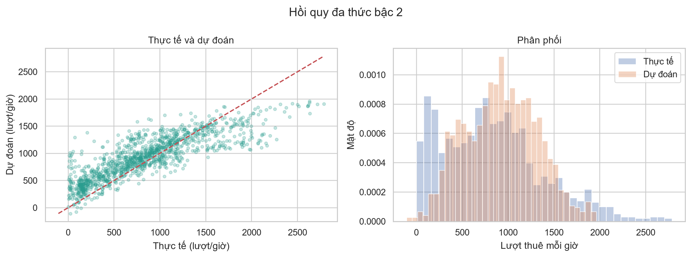
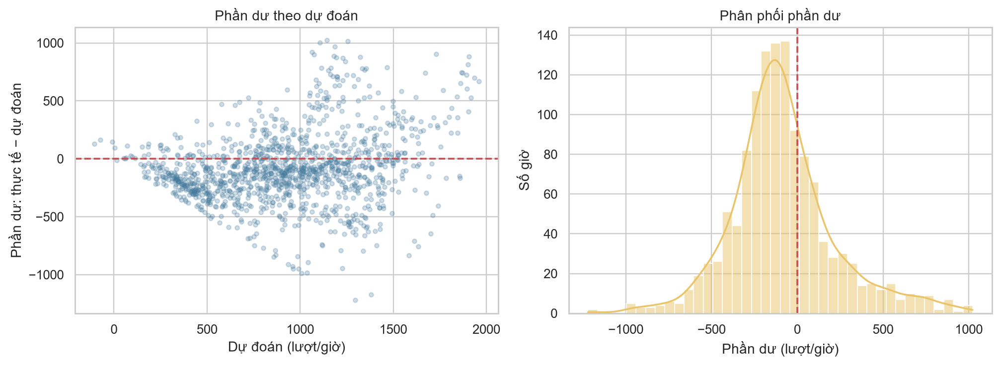

## CHƯƠNG 6. KẾT QUẢ VÀ ĐÁNH GIÁ

### 6.1. Kết quả định lượng trên tập kiểm tra

Tập kiểm tra cuối gồm 1.265 giờ từ 05/10 đến 30/11/2018. Giai đoạn này không tham gia học tham số hay chọn mô hình. Theo MSE trên tập chọn mô hình ở Chương 5, ứng viên được chọn là **hồi quy đa thức bậc hai**. Trước khi dự đoán tập cuối, nhóm huấn luyện lại mỗi ứng viên trên 7.200 giờ của tập huấn luyện và tập chọn mô hình gộp. Bảng 6.1 vẫn trình bày cả ba phương án để thấy quy mô cải thiện, nhưng quyết định lựa chọn đã được đưa ra ở giai đoạn trước.

**Bảng 6.1. Sai số trên 1.265 giờ kiểm tra cuối**

| Mô hình | MSE (lượt²/giờ²) | RMSE (lượt/giờ) | MAE (lượt/giờ) | R² |
|---|---:|---:|---:|---:|
| Mốc trung bình | 320.345,38 | 565,99 | 442,86 | -0,052 |
| Hồi quy tuyến tính | **99.663,51** | **315,70** | **229,75** | **0,673** |
| Hồi quy đa thức bậc hai | 100.114,19 | 316,41 | 242,38 | 0,671 |

Mô hình đa thức đã chọn có RMSE **316,41 lượt/giờ** và MAE **242,38 lượt/giờ**. RMSE lớn hơn MAE vì các giờ sai lệch mạnh được bình phương trong MSE rồi mới lấy căn; do đó, chỉ báo này nhạy với sai số ở cao điểm. R² bằng **0,671** nghĩa là trên chính giai đoạn kiểm tra, tổng sai số bình phương thấp hơn đáng kể so với cách luôn dự đoán bằng trung bình của giai đoạn đó. Mốc trung bình học từ dữ liệu quá khứ có R² âm (-0,052), cho thấy mức trung bình cũ không phù hợp hoàn toàn với giai đoạn cuối năm. So với mốc trung bình, mô hình đa thức giảm RMSE khoảng **44,1%**, nhưng vẫn còn sai số tuyệt đối đáng kể cho từng giờ.

Điểm cần báo cáo trung thực là hồi quy tuyến tính đạt MSE **thấp hơn khoảng 0,45%** và MAE thấp hơn 12,64 lượt/giờ so với đa thức trên tập cuối. Ở tập chọn mô hình, đa thức lại có MSE thấp hơn tuyến tính 1,81%. Sự đổi thứ tự cho thấy phần phi tuyến chưa tạo ra lợi thế ổn định giữa hai giai đoạn. Nhóm **không đổi mô hình được chọn sau khi xem tập kiểm tra**, vì như vậy sẽ dùng tập này thêm một lần cho quyết định mô hình và làm mất vai trò đánh giá độc lập. Với mục tiêu triển khai một mô hình gọn, tuyến tính là ứng viên hợp lý để kiểm tra tiếp trên dữ liệu mới.

### 6.2. Đối chiếu giá trị thực và dự đoán

Hình 6.1 gồm biểu đồ phân tán và biểu đồ phân phối của mô hình đa thức đã chọn. Ở biểu đồ phân tán, đường chéo biểu diễn dự đoán hoàn hảo: điểm nằm phía trên đường là dự đoán cao hơn thực tế, phía dưới là dự đoán thấp hơn thực tế. Nhiều giờ có nhu cầu thực tế rất cao nằm phía dưới đường, trong khi những giờ nhu cầu gần 0 thường được dự đoán cao hơn. Mô hình vì vậy có xu hướng kéo các mức cực trị về vùng giữa. Biểu đồ phân phối bên cạnh xác nhận dải dự đoán hẹp hơn dải giá trị thực: phần đuôi nhu cầu rất thấp và rất cao đều được mô tả chưa tốt.

### 6.3. Phân tích phần dư và sai số theo giờ

Phần dư được tính bằng `giá trị thực − giá trị dự đoán`. Phần dư dương nghĩa là mô hình dự đoán thiếu; phần dư âm nghĩa là dự đoán thừa. Nếu sai số không có cấu trúc rõ, các điểm ở hình 6.2 sẽ phân bố tương đối đều quanh đường 0. Dữ liệu thực tế cho thấy độ rộng phần dư thay đổi theo mức dự đoán và xuất hiện cả những sai lệch lớn. Histogram phần dư cũng không tập trung hoàn toàn tại 0. Đây là bằng chứng trực quan rằng mô hình chưa mô tả đầy đủ một số tình huống, đặc biệt khi nhu cầu tăng mạnh; biểu đồ không thay thế một kiểm định thống kê về giả định của sai số.

Khi tách theo giờ, sai số không đồng đều. **Bảng 6.2** nêu hai giờ có MAE lớn nhất và một giờ có sai số thấp để đối chiếu; mỗi giờ trong bảng có 53 quan sát ở tập kiểm tra.

| Giờ | MAE (lượt/giờ) | Nhận xét |
|---|---:|---|
| 08:00 | 634,63 | Cao điểm buổi sáng, khó dự đoán nhất trong giai đoạn kiểm tra. |
| 18:00 | 450,65 | Cao điểm cuối ngày, sai số vẫn lớn. |
| 10:00 | 92,57 | Sai số thấp hơn nhiều so với hai giờ cao điểm. |

Ngoài ra, mô hình đa thức tạo **3 dự đoán âm trong 1.265 giờ**. Số lượt thuê không thể âm, nên đầu ra này không phù hợp về mặt vận hành dù tỷ lệ nhỏ. Nếu dùng mô hình để hỗ trợ phân bổ xe, cần xử lý ràng buộc không âm và kiểm tra lại sai số sau xử lý; kết quả trong bảng hiện giữ nguyên dự đoán gốc để so sánh công bằng.

### 6.4. Mức độ tin cậy và hướng sử dụng

Kết quả cho thấy biến lịch và thời tiết giúp dự đoán tốt hơn rõ rệt so với một mức trung bình cố định, nhưng chưa đủ để khẳng định mô hình ổn định qua các năm. Bộ dữ liệu chỉ dài một năm; tập kiểm tra lại tập trung vào mùa Thu cuối năm, còn tập huấn luyện ban đầu chưa có quan sát mùa Thu. Danh sách biến đã chịu ảnh hưởng từ EDA trên toàn bộ dữ liệu, nên cần một tập dữ liệu mới để xác nhận cả lựa chọn biến lẫn kết quả mô hình. Các giờ liên tiếp cũng có thể có sai số phụ thuộc nhau, trong khi nhóm chưa mô hình hóa chuỗi thời gian hoặc nhu cầu của giờ trước. Thêm nữa, đánh giá sử dụng số đo thời tiết của chính giờ được dự đoán; khi vận hành sớm hơn, sai số dự báo thời tiết sẽ làm sai số nhu cầu tăng thêm.

Vì vậy, mô hình hiện phù hợp như **mốc dự báo và công cụ phân tích** hơn là căn cứ duy nhất để quyết định số xe tại từng giờ cao điểm. Bước tiếp theo nên thu thập thêm nhiều năm, đánh giá riêng từng mùa và giờ cao điểm, kiểm tra phương án dùng dự báo thời tiết thực tế, rồi mới quyết định giữa mô hình tuyến tính gọn và các mô hình phức tạp hơn. Các mối liên hệ được nêu trong chương là khả năng dự đoán trên dữ liệu quan sát, không chứng minh thời tiết hay lịch là nguyên nhân độc lập của nhu cầu thuê xe.
